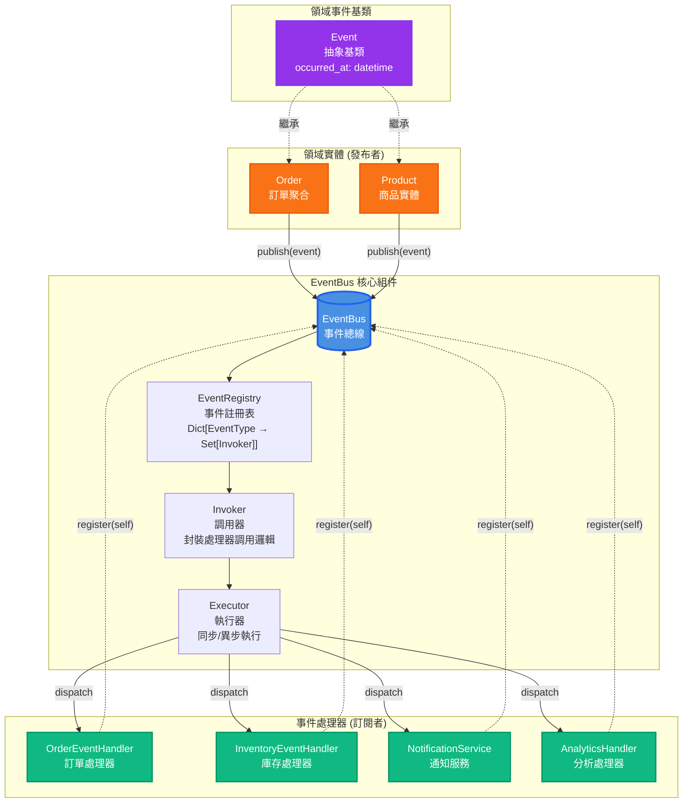
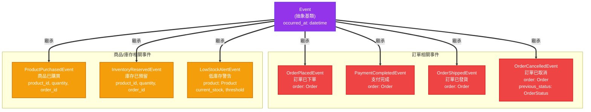
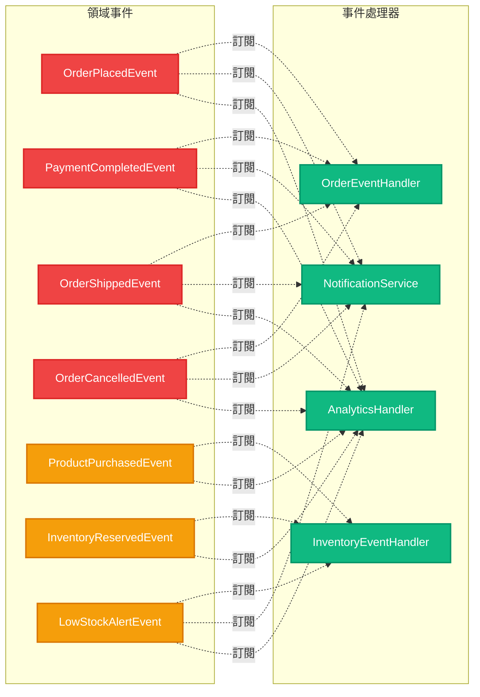
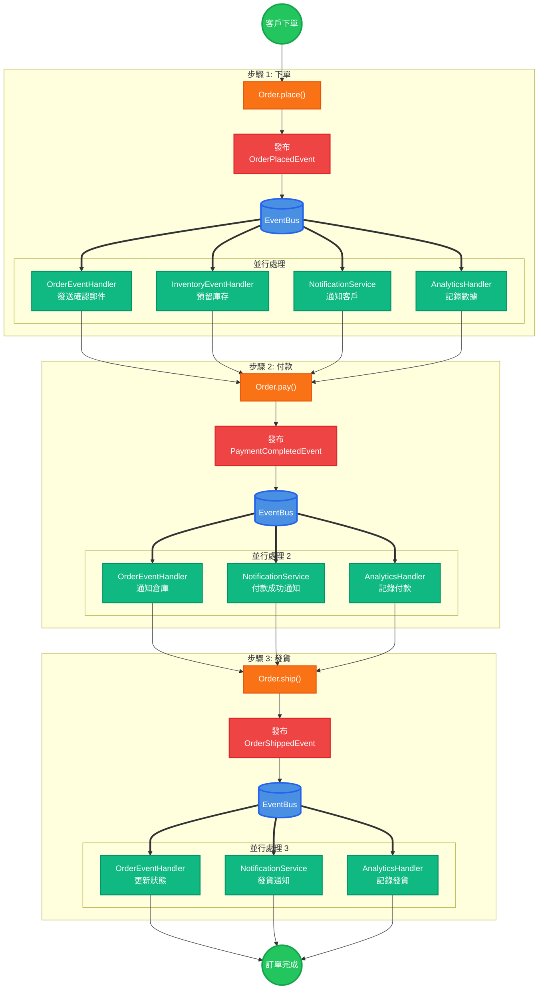
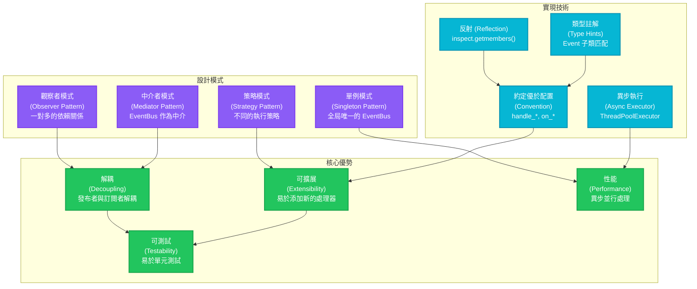

## 1. EventBus 核心架構

---

## 2. 事件繼承層次結構

---

## 3. 事件訂閱關係圖

---

## 4. 完整的事件流程 (訂單處理)

---

## 5. EventBus 內部工作流程

```mermaid
flowchart TB
    START(("應用啟動"))
    
    subgraph "初始化階段"
        INIT1["創建 EventBus"]
        INIT2["創建 EventRegistry"]
        INIT3["創建 Executor<br/>(ThreadPoolExecutor)"]
        INIT4["創建事件處理器<br/>(OrderEventHandler, etc.)"]
    end
    
    subgraph "註冊階段"
        REG1["handler.register(listener)"]
        REG2["掃描 listener 的方法<br/>inspect.getmembers()"]
        REG3{"方法名是否以<br/>handle_ 或 on_ 開頭?"}
        REG4["檢查第一個參數<br/>的類型註解"]
        REG5{"參數類型是否<br/>繼承自 Event?"}
        REG6["創建 Invoker<br/>(listener, method, event_type)"]
        REG7["加入註冊表<br/>registry[event_type].add(invoker)"]
    end
    
    subgraph "發布階段"
        PUB1["entity.method()<br/>(如 order.place())"]
        PUB2["創建事件對象<br/>(如 OrderPlacedEvent)"]
        PUB3["event_bus.publish(event)"]
        PUB4["獲取事件類型<br/>type(event)"]
        PUB5["查找訂閱者<br/>registry[event_type]"]
        PUB6{"有訂閱者?"}
    end
    
    subgraph "分發階段 (同步)"
        SYNC1["遍歷所有 invokers"]
        SYNC2["invoker.invoke(event)"]
        SYNC3["method(event)"]
        SYNC4["處理器執行業務邏輯"]
    end
    
    subgraph "分發階段 (異步)"
        ASYNC1["遍歷所有 invokers"]
        ASYNC2["executor.submit(invoker, event)"]
        ASYNC3["線程池執行"]
        ASYNC4["invoker.invoke(event)"]
        ASYNC5["method(event)"]
    end
    
    END(("完成"))
    
    START --> INIT1
    INIT1 --> INIT2
    INIT2 --> INIT3
    INIT3 --> INIT4
    
    INIT4 --> REG1
    REG1 --> REG2
    REG2 --> REG3
    REG3 -->|"是"| REG4
    REG3 -->|"否"| REG2
    REG4 --> REG5
    REG5 -->|"是"| REG6
    REG5 -->|"否"| REG2
    REG6 --> REG7
    
    REG7 --> PUB1
    PUB1 --> PUB2
    PUB2 --> PUB3
    PUB3 --> PUB4
    PUB4 --> PUB5
    PUB5 --> PUB6
    
    PUB6 -->|"同步模式"| SYNC1
    SYNC1 --> SYNC2
    SYNC2 --> SYNC3
    SYNC3 --> SYNC4
    SYNC4 --> END
    
    PUB6 -->|"異步模式"| ASYNC1
    ASYNC1 --> ASYNC2
    ASYNC2 --> ASYNC3
    ASYNC3 --> ASYNC4
    ASYNC4 --> ASYNC5
    ASYNC5 --> END
    
    PUB6 -->|"無訂閱者"| END
    
    style START fill:#22c55e,stroke:#16a34a,stroke-width:3px,color:#fff
    style END fill:#22c55e,stroke:#16a34a,stroke-width:3px,color:#fff
    
    style INIT1 fill:#6366f1,stroke:#4f46e5,stroke-width:2px,color:#fff
    style INIT2 fill:#6366f1,stroke:#4f46e5,stroke-width:2px,color:#fff
    style INIT3 fill:#6366f1,stroke:#4f46e5,stroke-width:2px,color:#fff
    style INIT4 fill:#6366f1,stroke:#4f46e5,stroke-width:2px,color:#fff
    
    style REG1 fill:#8b5cf6,stroke:#7c3aed,stroke-width:2px,color:#fff
    style REG2 fill:#8b5cf6,stroke:#7c3aed,stroke-width:2px,color:#fff
    style REG3 fill:#ec4899,stroke:#db2777,stroke-width:2px,color:#fff
    style REG4 fill:#8b5cf6,stroke:#7c3aed,stroke-width:2px,color:#fff
    style REG5 fill:#ec4899,stroke:#db2777,stroke-width:2px,color:#fff
    style REG6 fill:#8b5cf6,stroke:#7c3aed,stroke-width:2px,color:#fff
    style REG7 fill:#8b5cf6,stroke:#7c3aed,stroke-width:2px,color:#fff
    
    style PUB1 fill:#f97316,stroke:#ea580c,stroke-width:2px,color:#fff
    style PUB2 fill:#f97316,stroke:#ea580c,stroke-width:2px,color:#fff
    style PUB3 fill:#f97316,stroke:#ea580c,stroke-width:2px,color:#fff
    style PUB4 fill:#f97316,stroke:#ea580c,stroke-width:2px,color:#fff
    style PUB5 fill:#f97316,stroke:#ea580c,stroke-width:2px,color:#fff
    style PUB6 fill:#ec4899,stroke:#db2777,stroke-width:2px,color:#fff
    
    style SYNC1 fill:#10b981,stroke:#059669,stroke-width:2px,color:#fff
    style SYNC2 fill:#10b981,stroke:#059669,stroke-width:2px,color:#fff
    style SYNC3 fill:#10b981,stroke:#059669,stroke-width:2px,color:#fff
    style SYNC4 fill:#10b981,stroke:#059669,stroke-width:2px,color:#fff
    
    style ASYNC1 fill:#06b6d4,stroke:#0891b2,stroke-width:2px,color:#fff
    style ASYNC2 fill:#06b6d4,stroke:#0891b2,stroke-width:2px,color:#fff
    style ASYNC3 fill:#06b6d4,stroke:#0891b2,stroke-width:2px,color:#fff
    style ASYNC4 fill:#06b6d4,stroke:#0891b2,stroke-width:2px,color:#fff
    style ASYNC5 fill:#06b6d4,stroke:#0891b2,stroke-width:2px,color:#fff
```

---

## 6. 設計模式關係圖

---

## 說明

### 顏色編碼
- 🔵 **藍色**: EventBus 核心組件
- 🟣 **紫色**: 事件基類和註冊相關
- 🟠 **橙色**: 領域實體 (發布者)
- 🔴 **紅色**: 訂單相關事件
- 🟡 **黃色**: 商品/庫存相關事件
- 🟢 **綠色**: 事件處理器 (訂閱者) / 成功狀態
- 🔷 **青色**: 異步處理
- 🟥 **粉紅色**: 決策節點

### 關係類型
- **實線箭頭 (→)**: 直接調用或數據流
- **虛線箭頭 (-.->)**: 訂閱關係或繼承關係
- **粗箭頭 (==>)**: 強調的關係 (如繼承、並行分發)

### 圖表說明
1. **核心架構圖**: 展示 EventBus 的整體架構和組件關係
2. **繼承層次圖**: 展示所有事件的繼承結構
3. **訂閱關係圖**: 清楚顯示哪個處理器訂閱哪些事件
4. **完整流程圖**: 展示訂單處理的完整事件流程
5. **內部工作流程**: 詳細展示 EventBus 內部的工作機制
6. **設計模式圖**: 展示使用的設計模式和實現技術
