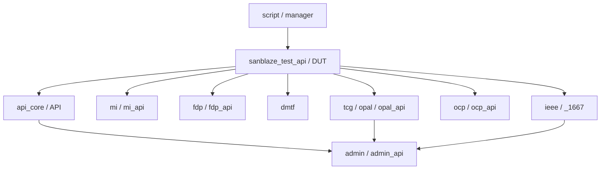

# 專案知識文件：sanblaze_py_api

## 1. 專案概述
- **功能描述**：一個用 Python 撰寫的全面性自動化測試與控制框架，針對 NVMe 與 OCP 固態硬碟 (SSD)，提供各項進階功能測試（包含 FDP, DMTF/PLDM/SPDM, IEEE1667, OCP 規範與 TCG Opal 安全協定）。
- **程式語言**：Python
- **技術棧**：原生 Python (Requests, Subprocess, Watchdog, contextlib 等)，並透過底層 CLI 工具 (`mi`, `io`, `iRiser`) 與硬體溝通。

## 2. 架構總覽

### 模組清單
| 模組名稱 | 檔案路徑 | 一句話說明用途 |
|----------|----------|----------------|
| API Core | `api_core.py` | 核心 API 基礎類別，封裝基礎 NVMe 控制、Identify、Feature 等邏輯 |
| Test API | `sanblaze_test_api.py` | 測試框架進入點與生命週期管理 (`DUT` 類別與 `@setup` 裝飾器) |
| Admin | `admin/admin_api.py` | 實作 NVMe Admin 指令集 (Sanitize, Lockdown, Identify 等) |
| MI | `mi/mi_api.py` | 實作 NVMe-MI (Management Interface) 透過不同傳輸層管理 |
| FDP | `fdp/fdp_api.py` | 實作 Flexible Data Placement (FDP) 特性之配置與切換 |
| DMTF | `dmtf/` | 包含 PLDM (韌體更新與狀態) 與 SPDM (安全協定認證與憑證管理) 實作 |
| IEEE 1667 | `ieee/_1667/api.py` | 透過 NVMe Security Send/Receive 實作 IEEE 1667 認證標準 |
| OCP | `ocp/ocp_api.py` | OCP Datacenter SSD 規範特定 Feature/Log Page 支援與錯誤恢復 |
| Script | `script/manager.py` | 管理腳本執行、並行測試與 Workload IO 監控與鎖定機制 |
| System | `system/iRiser/riser.py`| iRiser 硬體控制模組，執行 GPIO 切換與高頻率 DMA 功耗採樣 |
| TCG Opal | `tcg/opal/opal_api.py` | 實作 TCG Opal 安全協定 (Authentication, Session 管理與資料加解密) |

### 核心依賴關係圖


---

## 3. 模組詳細說明（模組職責卡片）

---
## 模組：`api_core.py` 與 `script/dut.py`

### 職責概述
定義測試用的目標設備（DUT, Device Under Test）物件，並繼承多個子系統（OCP, FDP, TCG等），作為所有硬體操作與狀態查詢的最核心入口。

### 模組關係
- 依賴：`core.api`, `legacy.sanblaze_apis.XML_API`
- 被依賴：測試腳本、`sanblaze_test_api.py`

### 對外函式（Public Interface）

#### `get_dut(target: str) -> DUT`
- 用途：實例化並回傳一個對應目標插槽的 `DUT` 物件。
- 參數說明：target — SSD 目標設備的編號 (例如 '1101')。
- 回傳值：`DUT` 類別的實例。
- 副作用：無。
- 使用範例：
  ```python
  dut = get_dut("1101")
  ```

#### `DUT.add(base: class, string: str, version: str = None) -> None`
- 用途：為 DUT 物件動態掛載子模組 API (例如 `.ocp`, `.fdp`)。
- 參數說明：base — 模組類別；string — 掛載的屬性名稱；version — 可選版本。
- 回傳值：無。
- 副作用：修改 DUT 物件屬性並合併該模組的 JSON 定義與指令集。
- 使用範例：
  ```python
  dut.add(OCP, 'ocp', version='2_6')
  ```

### 私有函式（內部實作，不對外）
- `_get_slot()` — 取得目前裝置位於機箱內的實體 Slot 號碼。
- `_get_pci()` — 取得裝置的 PCIe 位址。
---

## 模組：`admin/admin_api.py`

### 職責概述
負責發送 NVMe Admin Commands (如 Identify, Get/Set Features, Log Pages, Sanitize 等)。

### 模組關係
- 依賴：`api_core.py`
- 被依賴：`tcg_opal.py`, `ieee_1667.py`, 測試腳本。

### 對外函式（Public Interface）

#### `security_send(secp, spsp1, spsp0, tl, data)`
- 用途：發送 NVMe Security Send 指令，這是 TCG 與 IEEE1667 的底層依賴。
- 參數說明：secp — 安全通訊協定代碼；tl — 傳輸長度；data — 實際 Payload 內容。
- 回傳值：指令執行結果與裝置回應狀態。
- 副作用：傳送資料到硬體安全模組。

#### `security_receive(secp, spsp1, spsp0, al)`
- 用途：發送 NVMe Security Receive 指令以取得安全協定的回應。
- 參數說明：al — 配置的接收長度 (Allocation Length)。
- 回傳值：包含接收到之二進位/解析後資料的字典。
- 副作用：無。

### 私有函式（內部實作，不對外）
- (Admin 的內部輔助由 `Utils` 類別處理，例如對特定欄位狀態的查詢解析。)
---

## 模組：`script/manager.py`

### 職責概述
管理整個測試腳本的生命週期，包含腳本啟動前的環境初始化、執行過程中的狀態鎖定 (避免多執行緒衝突)、與最後的測試結果彙整 (Passed/Failed)。

### 模組關係
- 依賴：`watchdog` (監控系統狀態改變), `Bridge` (與底層系統溝通狀態)。
- 被依賴：`sanblaze_test_api.py` (用來啟動 TestManager)。

### 對外函式（Public Interface）

#### `TestManager(dut, configs)` (Context Manager)
- 用途：保護腳本執行，確保進入時獲取硬體存取鎖 (`python_lock`)，並設定腳本狀態為 Running。離開時釋放資源並統計錯誤數量決定測試是否成功。
- 參數說明：dut — 目標測試設備；configs — 腳本的預設組態設定。
- 回傳值：`TestManager` 實例。
- 副作用：鎖定系統目錄 `/rest/sanblazes/.../python_lock`，寫入日誌。
- 使用範例：
  ```python
  with TestManager(dut, configs) as tm:
      # run test steps
  ```

#### `fail_test(message: str) -> None`
- 用途：強制中斷目前測試並標記為 Failed。
- 參數說明：message — 失敗原因說明。
- 回傳值：無 (拋出 `TestFailedException`)。
- 副作用：中斷程式執行流程。

### 私有函式（內部實作，不對外）
- `_update_traffic_counts()` — 背景執行緒定時統計 I/O 的讀寫數量。
- `_get_software_version()` — 讀取系統檔案確認底層軟體版本。
---

## 模組：`script/workload.py`

### 職責概述
負責啟動與管理針對 SSD 的背景 I/O 測試 (讀寫/比較/驗證)，支援調整 Block Size, Queue Depth, Pattern 等。

### 模組關係
- 依賴：底層 `/iport` 虛擬檔案系統介面 (`proc_write`)。
- 被依賴：測試腳本 (用來給予硬體壓力)。

### 對外函式（Public Interface）

#### `Workload(dut, nsid, params)`
- 用途：建立一個 I/O Workload 實例。
- 參數說明：dut — 目標設備；nsid — 測試的 Namespace ID；params — I/O 測試參數 (如 iotype, threads, blocks)。
- 回傳值：`Workload` 實例。
- 副作用：無。

#### `start(time_s: int = None) -> dict`
- 用途：正式送出指令到底層啟動 I/O 測試。
- 參數說明：time_s — (選填) 讓測試跑幾秒鐘後自動暫停。
- 回傳值：狀態碼與 Test ID。
- 副作用： SSD 開始進行背景讀寫。
- 使用範例：
  ```python
  io = Workload(dut, params={'iotype': 'Write'})
  io.start(time_s=60)
  ```

#### `stop(timeout: int = 60) -> None`
- 用途：停止該背景 I/O 測試。
- 副作用：中斷 SSD 正在進行的背景讀寫。

### 私有函式（內部實作，不對外）
- `_get_test_id()` — 產生暫時的測試識別碼。
---

## 模組：`system/iRiser/riser.py`

### 職責概述
控制 iRiser5 治具，提供 PCIe 插槽的重置、信號 (GPIO) 切換以及透過 DMA 引擎擷取超高精度的功耗數據。

### 模組關係
- 依賴：`subprocess` 呼叫底層 `iRiser` 執行檔, `numpy` (處理大批功耗數據)。
- 被依賴：需要測量功耗、模擬熱拔插、斷電測試的腳本。

### 對外函式（Public Interface）

#### `Riser(slot: int)`
- 用途：初始化特定 Slot 的 iRiser 控制物件。
- 參數說明：slot — iRiser 實體所在插槽 (0-31)。

#### `start_collect_power(dir_name, samples, duration, power_devices)`
- 用途：啟動 DMA 引擎在背景收集高頻率的功耗數據並存檔。
- 參數說明：dir_name — 紀錄存放目錄；samples — 取樣率字串 (如 '10us')；duration — 測量時間 (如 '5s')。
- 回傳值：執行結果狀態字典。
- 副作用：在系統內產生大量的功耗紀錄檔案，消耗儲存空間與記憶體。
- 使用範例：
  ```python
  riser = Riser(1)
  riser.start_collect_power('testcapture', '100us', '10s')
  ```

#### `get_all_data_chunk(dir_name, power_device, start, end)`
- 用途：從之前收集的功耗檔案中，將大數據分批轉為 Numpy 陣列。
- 回傳值：包含 `power_data` (1D Numpy Array) 的字典。
- 副作用：會載入大量資料至記憶體中。

### 私有函式（內部實作，不對外）
- `_is_valid_slot()` — 檢查傳入的插槽號碼是否有效。
- `execute_subprocess()` — 將 Python 呼叫轉換為 Shell Command 的內部封裝。
---

## 模組：`tcg/opal/opal_api.py`

### 職責概述
實作 TCG Opal 安全儲存標準。支援發送各種 TCG 封包、開啟與認證通訊 Session (Admin SP / Locking SP)，並取得 ComID。

### 模組關係
- 依賴：`admin/admin_api.py` (`security_send`/`receive`), `tcg/opal/tcg_builder.py` (構裝封包)。
- 被依賴：安全性驗證腳本。

### 對外函式（Public Interface）

#### `start_session(host_session_id, spid, ...)`
- 用途：針對特定的 SP (Security Provider) 開啟一個授權的會話。
- 參數說明：host_session_id — 主機端的 Session 號碼；spid — 目標 SP 的 ID (預設為 Admin SP)。
- 回傳值：TPer 回傳的 Session 結果。
- 副作用：改變了裝置的 TCG 狀態進入 Session 中。
- 使用範例：
  ```python
  result = dut.opal.start_session(spid=0x00_00_02_05_00_00_00_01)
  ```

#### `acquire_com_id(fallback=False)`
- 用途：發送 Level 0 Discovery 或透過 GET_COMID 請求一組有效的通訊 ID，作為後續安全通訊的基礎。
- 副作用：無。

#### `@opal_ensure_com_id` (Decorator)
- 用途：在執行 TCG 測試函式前，自動確保已經取得有效的 ComID。

### 私有函式（內部實作，不對外）
- `_build_and_send()` — 組合方法 ID 與參數，然後呼叫 Builder 封裝為 TCG 規範的 Subpacket 並透過 Admin 發送。
- `_status_string()` — 將 TCG 錯誤碼 (Status) 轉換為可讀的字串。
---

## 模組：`ocp/adaptation_parameters_parser.py`

### 職責概述
解析 OCP Datacenter SSD 規格中的 Adaptation Parameters (ADP) 檔案 (或直接從 `ocp.conf` 取代)，動態提供 SSD 的 OCP 預期能力與極限值 (如效能、功耗、溫度)。

### 模組關係
- 依賴：底層 `api_core` (用來動態從硬體 `Identify` 與 `Log Pages` 自動生成部分欄位)。
- 被依賴：`ocp_api.py` 及所有 OCP 驗證測試腳本。

### 對外函式（Public Interface）

#### `AdaptationParameters(dut, override=False)`
- 用途：讀取與解析 ADP 檔案內容。支援從 `/usr/lib/adaptation_parameters/` 目錄下讀取對應型號/序號的檔案。
- 參數說明：dut — 目標設備。
- 回傳值：表現行為類似字典 (Dict) 的物件，可以用 `params['QOS']` 存取數值。
- 副作用：如果開啟 `override` 模式，會直接向 SSD 查詢大量 Log Pages 並寫入預設值。

#### `parse_adaptation_parameters(filename)`
- 用途：單純根據 ADP 檔案路徑與內部定義的 JSON schema (`adaptation_parameters.json`) 進行二進制與文字解析。

### 私有函式（內部實作，不對外）
- `_generate_fields()` — 利用 SSD 實際硬體回報 (Log Page 0xC0~0xC6, Identify) 來自動填補某些未定義的 ADP 欄位。
- `_apply_defaults()` — 將 `ocp.conf` 中預定義的變數覆蓋寫入。
---

## 4. 常見使用情境

- **情境：進行 SSD 資料抹除 (Block Erase)**
  → 模組：`Admin` → 函式：`sanitize()` 或 `actions.py` 的 `block_erase_if_requested()`
  → 範例：
  ```python
  dut.admin.sanitize(sanact=2)
  ```

- **情境：OCP 測試中切換測試狀態與環境保護**
  → 模組：`OCP` → 函式：`@ocp_config` 裝飾器
  → 範例：
  ```python
  @ocp_config
  def my_ocp_test(dut):
      # The decorator will handle drive configuration and cleanup
      pass
  ```

- **情境：使用 TCG Opal 取得 ComID**
  → 模組：`TCG Opal` → 函式：`acquire_com_id()`
  → 範例：
  ```python
  with OpalEnsureComID(dut):
      # Run TCG tests safely with acquired ComID
      pass
  ```

- **情境：啟動 iRiser 功耗測量**
  → 模組：`System (iRiser)` → 函式：`start_collect_power`
  → 範例：
  ```python
  riser = Riser(1)
  riser.start_collect_power('test_log', '1ms', '60s')
  ```

## 5. 注意事項
- **副作用警告**：許多儲存相關的指令 (如 Namespace Management, Format NVM, Sanitize) 會摧毀資料，請確保在測試環境下執行。
- **初始化順序要求**：必須先建立 `DUT` 物件並確認控制器就緒 (`wait_for_controller`)，再呼叫各子模組 (如 `.admin`, `.ocp`, `.fdp`)。腳本開發請善用 `@setup` 或各模組提供的 context managers (如 `Cleanup`, `FDPConfig`)。
- **硬體鎖定**：`TestManager` 會使用 `/python_lock` 來確保同一目標裝置不會有並發衝突。

## 6. 給 AI 的快速導引
當你要讓另一個 AI 理解這個專案時，在對話開頭貼上：「以下是這個專案的知識文件，請閱讀後記住內容。之後我問的問題請對應到文件中的模組與函式來回答。本專案核心為 SANBlaze NVMe 測試框架，三個最關鍵的模組為 `sanblaze_test_api.py` (負責管理 DUT 測試裝置與生命週期)、`admin_api.py` (封裝底層硬體通訊與 NVMe 指令) 及 `script/manager.py` (負責腳本執行緒與硬體資源鎖定)。」